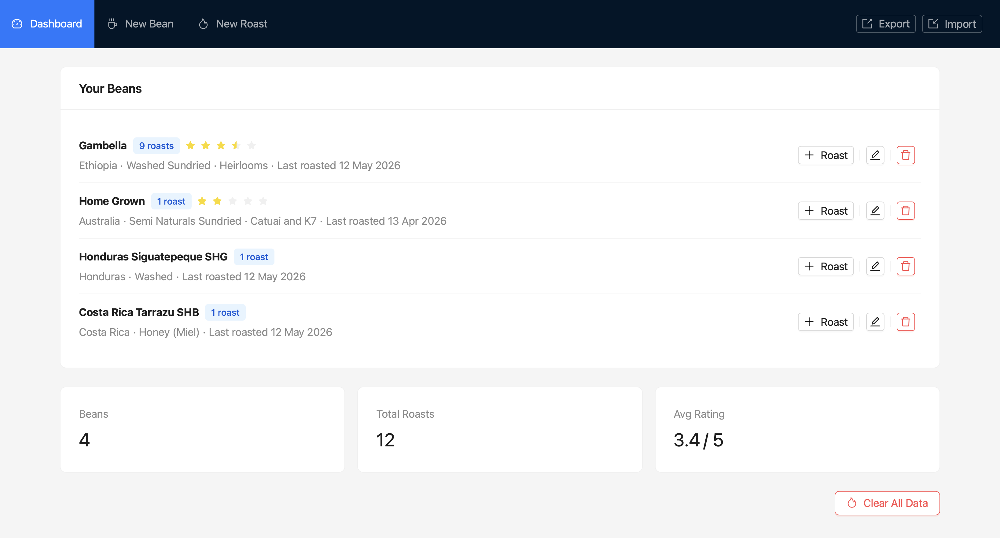
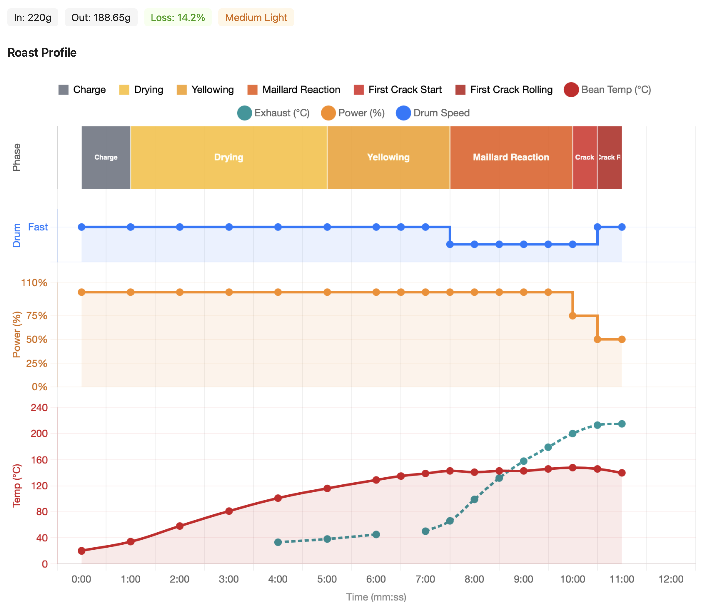

# ☕ Behmor Roast Logger

A personal roast logging app for home hobbyist coffee roasters — built specifically around the workflow of the **Behmor 1600** roaster. Track your roast profiles, visualise temperature curves, log tasting notes, and build up a library of your beans over time.

---

## What is this?

This app won't control your roaster, pull data from sensors, or automate anything. That's not the point.

The point is that you're a hands-on home roaster. You stand next to your Behmor, nose in the air, ears tuned for first crack, scribbling notes on whatever's nearby. Then you come inside, open this app, and enter what actually happened — minute by minute. The app turns those scribbles into a proper roast profile you can learn from, compare, and repeat.

> **This app requires you to monitor your roast closely and record all your data points manually. That's the whole vibe.**

---

## Features

- **Bean library** — catalogue your green beans with origin, estate, processing method and varietal
- **Roast logging** — step-by-step roast data entry with time, bean temp, exhaust temp, power level, drum speed and roast phase
- **Roast profile chart** — visualise your full roast with temperature curves (bean + exhaust), power levels, drum speed and a colour-coded phase timeline across the bottom
- **Edit past roasts** — made a typo mid-roast? Go back in and fix the step data after the fact
- **Magic wand copy** — on each step row, one click copies the power level, drum speed and phase from the previous row — speeds up entry when those values haven't changed
- **Auto-incrementing time** — steps pre-fill with 1:00, 2:00, 3:00 etc. as you add them, so you only need to correct outliers
- **Tasting notes** — add timestamped tasting notes to any roast
- **Star ratings** — rate each roast so you can sort and find your best ones
- **Batch weight tracking** — log green weight in and roasted weight out, with automatic weight loss percentage
- **Colour level** — record the roast colour (Light through to, uh, Incinerated)
- **Export / Import** — back up your full dataset as a JSON file and restore it any time
- **All local** — everything lives in your browser's local storage. No accounts, no cloud, no subscriptions

---

## Tech stack

This project was built with [Claude Sonnet 4.6](https://www.anthropic.com/claude) doing the heavy lifting on the code. I directed it, reviewed it, and steered it, making changes manually when needed. 

The libraries I chose, because they're genuinely great:

| Library | Why |
|---|---|
| **[Vite](https://vitejs.dev/)** | Instant dev server, lightning fast HMR — once you use it you can't go back |
| **[React 18](https://react.dev/)** | Obvious choice |
| **[Ant Design](https://ant.design/)** | Really clean UI components out of the box. |
| **[Chart.js](https://www.chartjs.org/)** | Flexible enough to build a proper stacked roast profile with custom plugins for the phase timeline band |

---

## Screenshots





---

## Getting started

### Prerequisites

- [Node.js](https://nodejs.org/) v18 or higher
- npm (comes with Node)

### Install and run

```bash
# Clone the repo
git clone https://github.com/YOUR_USERNAME/behmor-roast-logger.git
cd behmor-roast-logger

# Install dependencies
npm install

# Start the dev server
npm run dev
```

Then open [http://localhost:5173](http://localhost:5173) in your browser.

### Build for production

```bash
npm run build
```

The output goes to the `dist/` folder. You can host it anywhere that serves static files — GitHub Pages, Netlify, Vercel, or just open `index.html` locally.

---

## How to use it

1. **Add your beans** — go to the Beans tab and add your green coffee. Fill in as much or as little detail as you like.
2. **Start a roast log** — from the bean's page, click New Roast. Set your date and batch weight.
3. **Add steps as you go (or after)** — each step captures the time, temperatures, power level, drum speed and roast phase. Use the ⚡ wand button to copy settings from the previous row when they haven't changed.
4. **Save the roast** — your profile is saved locally. Come back to it any time.
5. **Review and edit** — open any saved roast to see the profile chart, edit steps if you logged something wrong, and add tasting notes as you brew through the batch.
6. **Back up your data** — use the export button to save a JSON backup. Import it any time to restore.

---

## Project structure

```
src/
├── components/
│   ├── BeanForm.jsx      # Add / edit a bean
│   ├── Dashboard.jsx     # Bean list and top-level navigation
│   ├── RoastForm.jsx     # New roast entry form
│   ├── RoastLog.jsx      # Roast history, chart, and step editor
│   └── Stats.jsx         # Summary stats across all roasts
├── App.jsx               # App shell and state management
├── main.jsx              # Entry point
└── storage.js            # localStorage read/write with migration support
```

---

## Data and privacy

All your data is stored in your browser's `localStorage`. Nothing is sent anywhere. If you clear your browser data, your roast history goes with it — so use the export feature regularly to back up.

---

## Limitations and known quirks

- Built specifically for the **Behmor 1600** — power levels (100%, 75%, 50%, 25%) and drum speeds (Fast/D, Slow/P) match that machine's controls
- No real-time data capture — this is a manual logging tool by design
- Data lives in localStorage, so it's per-browser and per-device (use export/import to move between devices)

---

## Contributing

This is a personal project but if you use a Behmor (or another drum roaster with a similar manual feel) and want to suggest improvements, open an issue. Pull requests welcome.

---

## Licence

MIT — do whatever you like with it.

---

*Happy roasting. Don't walk away from the machine.*
